# DiscussionPlatform_ReactJS_Redux

## Overview
This is a React application that serves as the front end for a discussion platform. ([Link to Backend](https://github.com/JasonPauldj/DiscussionPlatform_SpringBoot_Hibernate)). It provides a user friendly UI for users to ask questions, post answers, and comments. Utilized React Router for client side routing. Leveraged Redux to manage the global state of the application.

## Versions

| Package | Versions |
| --- | ----------- |
| React | 18.2.0 |
| React-Redux | 8.0.5 |
| React Router | 6.10 |

## Images

### Pages
- Login Page
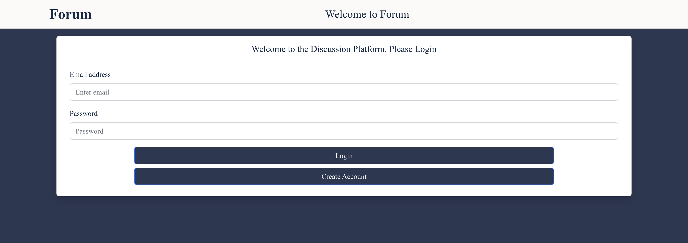

- Sign Up Page
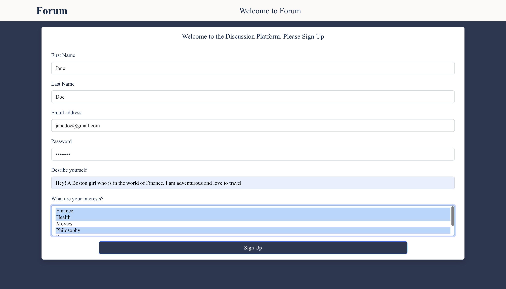

- Feed Page
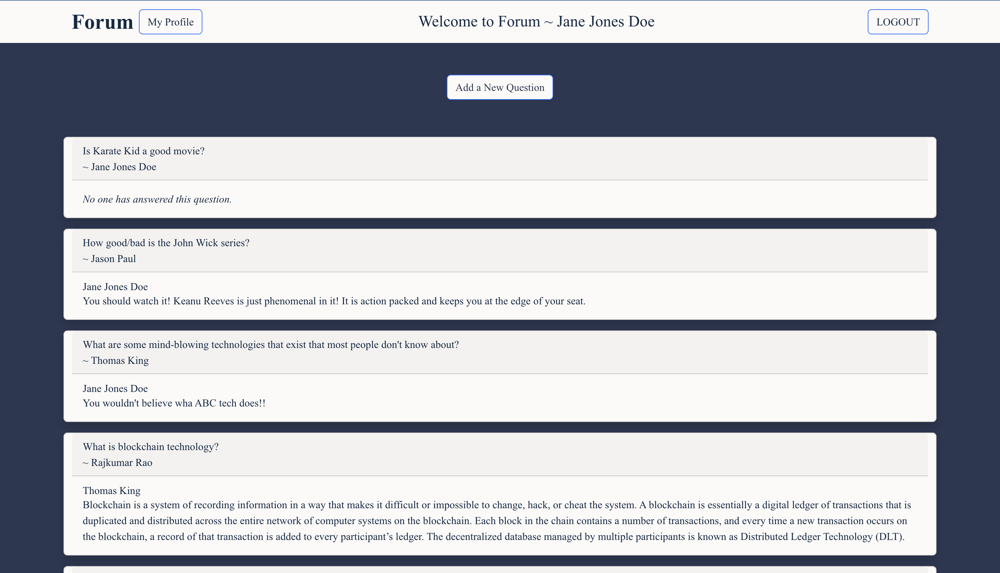

- Profile Page
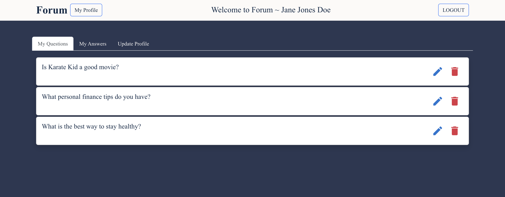

- Quesiton Page
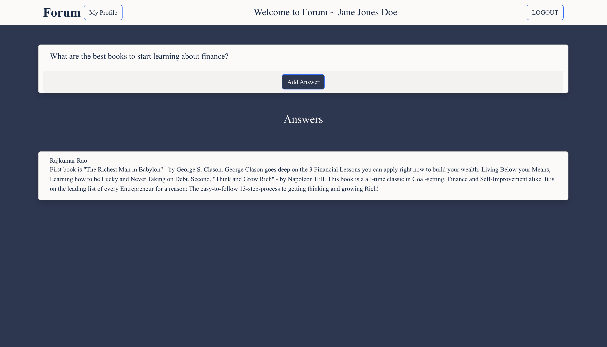

- Answer Page
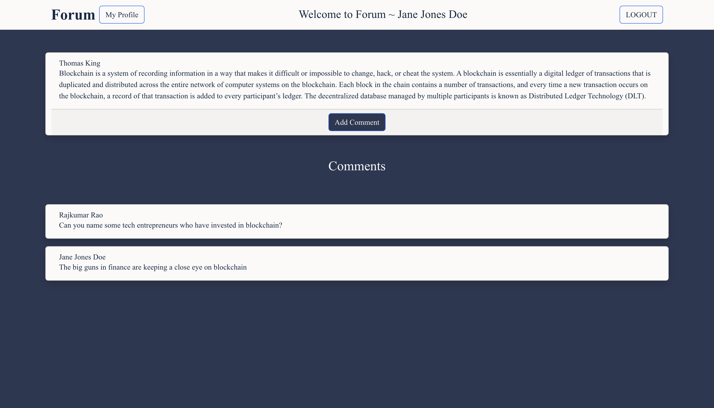

- Profile Update Page
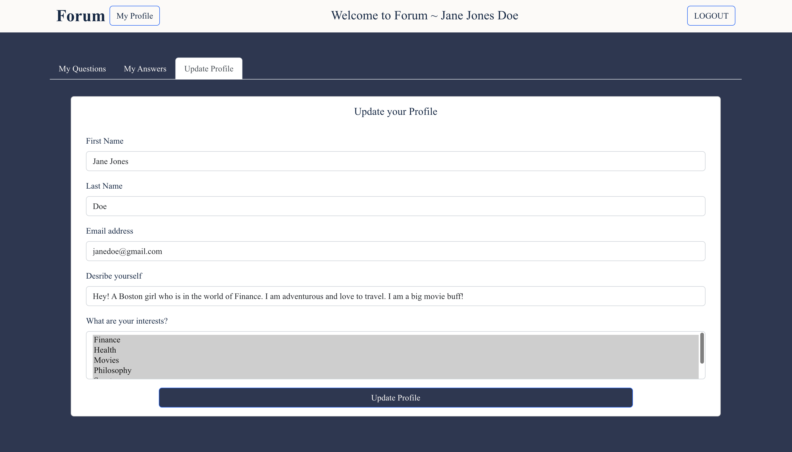

- My Question Page
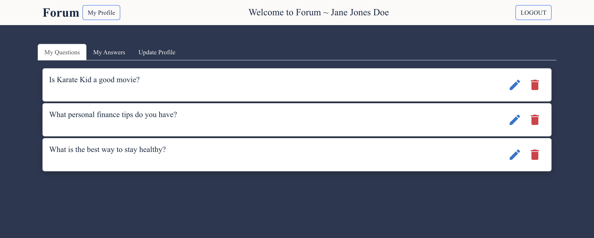

- My Answer Page
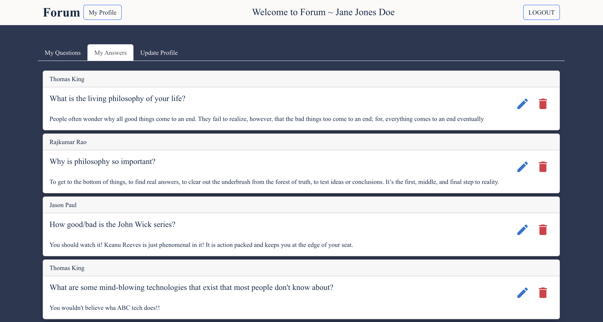

### Modals

- Question Modal
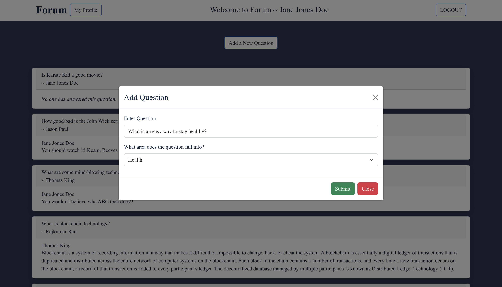

- Answer Modal
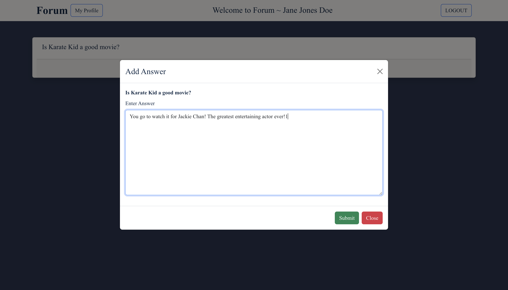

- Comment Modal

